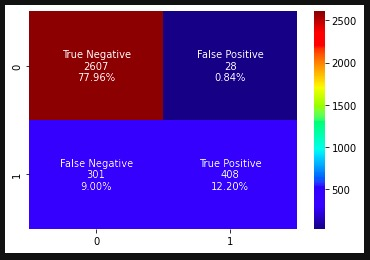

<h1><b>bank_customers_churn_prediction_exploring_7_different_classification_algorithms</b><h1>

<h3>This project deals with the classification of the bank customers on whether a customer will leave the bank (i.e.; churn) or not.</h3>
    
<h3><b><u>Project Life-Cycle:</u></b></h3>
<h3>As part of this project; below steps of a Data Science Project Life-Cycle is being implemented.</h3>
    
> <h3>1. Data Exploration, Analysis and Visualisations</h3>
> <h3>2. Data Pre-processing</h3>
> <h3>3. Data Preparation for the Modelling</h3>
> <h3>4. Model Training</h3>
> <h3>5. Model Validation</h3> 
> <h3>6. Optimized Model Selection based on Various Performance Metrics</h3>
> <h3>7. Deploying the Best Optimized Model into Unseen Test Data</h3> 
> <h3>8. Evaluating the Optimized Model’s Performance Metrics</h3> 

<h3>The business case and the problem statement to determine the churn status of the bank customers are explored, trained and validated on 7 different classification algorithms/models as listed below and the best finalized optimized model is selected based on the various performance metrics namely accuracy, precision, recall and f1-score.</h3>

> <h3>1. Decision Tree Classifier - CART (Classification and Regression Tree) Algorithm</h3> 
> <h3>2. Decision Tree Classifier - IDE (Iterative Dichotomiser) Algorithm</h3>
> <h3>3. Ensemble Random Forest Classifier Algorithm</h3> 
> <h3>4. Ensemble Adaptive Boosting Classifier Algorithm</h3> 
> <h3>5. Ensemble Hist Gradient Boosting Classifier Algorithm</h3> 
> <h3>6. Ensemble Extreme Gradient Boosting (XGBoost) Classifier Algorithm</h3> 
> <h3>7. Support Vector Machine (SVM) Classifier Algorithm</h3>

<h3><b><u>Performance Metrics and Results of all the Optimized Classifier Models:</u></b></h3>
    

<h3><b><u>Accuracy Metrics of all the Optimized Classifier Models:</u></b></h3>
    

    
<h3><b><u>Selection and Decision on Final Optimized Classifier Model for Deployment:</u></b></h3>
<h3>As we can see from the above results; models named "Ensemble Random Forest Classifier Model" and "Ensemble Extreme Gradient Boosting (XGBoost) Classifier Model" have performed comparatively better during the validation stage.</h3> 
<h3>However; by considering the "Churn" Class Precision Score which is one of the key performance metric in this business case, it is evident that the "Ensemble Extreme Gradient Boosting (XGBoost) Classifier Model" performed significantly much better when compared with that of the "Ensemble Random Forest Classifier Model".</h3>
<h3>Hence we can decide and consider "Ensemble Extreme Gradient Boosting (XGBoost) Classifier Model" as the final model to be deployed into the unseen test data.</h3>  
    
<h3><b><u>Performance Results on the Unseen Test Data:</u></b></h3>
    

    
 
    

 
    
<h3>As we can see from the above test performance results; Extreme Gradient Boosting (XGBoost) Model has performed with an overall accuracy of about <b>90%</b> on the unseen test data.
    
 
 
 
